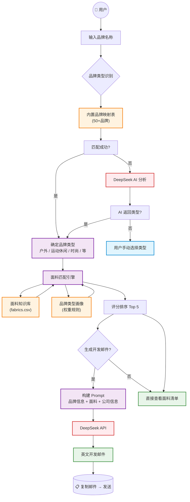

# 🧵 面料外贸客户开发 Agent

一款面向外贸业务员的小型 AI 工具，输入海外品牌名称即可自动推荐最匹配的功能性面料，并生成专业的英文开发邮件。

## 功能概览

- **品牌—面料智能匹配** — 输入品牌名（如 Patagonia、Nike、Zara），自动识别品牌类型，从面料库中匹配最适合的面料
- **英文开发邮件自动生成** — 基于匹配结果，调用 DeepSeek AI 撰写个性化 B2B 开发邮件，纯文本输出，复制即用
- **面料知识库管理** — 内置 29 款功能性面料的结构化数据，支持随时扩展更新
- **公司信息配置** — 可在侧边栏录入公司名称、工厂优势、认证资质等，自动嵌入邮件

---

## 系统架构



---

## 工作流程

### 1. 品牌类型识别

```
输入: "Patagonia"
        │
        ▼
┌─────────────────────────────────────┐
│  ① 内置品牌表查询                     │
│  → Patagonia 命中 → "户外 (Outdoor)"  │
│     (不区分大小写，支持模糊匹配)        │
├─────────────────────────────────────┤
│  ② 未命中 → DeepSeek AI 分析          │
│  → "这属于哪个品牌类型？"              │
│  → AI 返回 "户外 (Outdoor)"           │
├─────────────────────────────────────┤
│  ③ 仍未知 → 用户手动选择              │
│  → 下拉菜单：户外/运动休闲/时尚/...    │
└─────────────────────────────────────┘
```

### 2. 面料匹配评分

匹配引擎综合三个维度对面料打分：

| 维度 | 说明 | 示例 |
|------|------|------|
| 🎯 类别权重 | 品牌类型偏好的面料类别 | 户外 → 防晒类 +10分 |
| 🔗 品牌适配 | 面料标注了适合该品牌类型 | 适合"户外" → +3分 |
| 🔑 关键词匹配 | 面料功能特点命中品牌关键词 | features 含"防晒" → +1分 |

最终按总分降序排列，取 Top 5 作为推荐结果。

### 3. 邮件生成

将品牌信息 + 推荐面料 + 公司信息 组装成结构化 Prompt，调用 DeepSeek API 生成英文开发邮件。

---

## 技术栈

| 技术 | 用途 |
|------|------|
| **Python 3.9+** | 编程语言 |
| **Streamlit** | Web UI 框架 |
| **DeepSeek API** | AI 文本生成（邮件撰写 + 品牌分析） |
| **Pandas** | 面料数据加载和处理 |
| **OpenAI SDK** | DeepSeek API 调用（接口兼容） |
| **CSV** | 面料知识库存储 |

---

## 安装与启动

### 前置要求

- Python 3.9 或更高版本
- DeepSeek API Key（[去 platform.deepseek.com 注册获取](https://platform.deepseek.com)）

### 安装步骤

```bash
# 1. 进入项目目录
cd fabric-agent

# 2. 安装依赖
pip install -r requirements.txt

# 3. 配置 API Key（方式一：写入 .env 文件）
echo "DEEPSEEK_API_KEY=sk-你的真实Key" > .env

# 4. 启动应用
streamlit run app.py
```

启动后终端会显示访问地址，默认为 **http://localhost:8501**。

---

## 使用说明

### 首次使用

```
① 打开 http://localhost:8501
② 左侧侧边栏 → 填入 DeepSeek API Key
③ （可选）填写公司信息 → 点击保存
④ 开始使用
```

### 日常使用

```
① 输入目标品牌名称（英文）
   示例：Patagonia、Lululemon、Nike、Zara、The North Face
② 选择品牌类型
   - 「自动识别」：系统先查内置表，未命中则用 AI 分析
   - 手动选择：直接指定品牌类型
③ 点击「🔍 开始匹配」
④ 查看推荐面料（显示匹配度和推荐理由）
⑤ 点击「✍️ 生成开发邮件」
⑥ 点击「📋 复制邮件」→ 粘贴到邮箱发送
```

### 公司信息配置

在侧边栏「公司信息」区域填写以下内容，这些信息会自动嵌入到生成的邮件中：

| 字段 | 说明 | 示例 |
|------|------|------|
| 公司名称 | 你的公司名 | XXX Textile Co., Ltd. |
| 工厂优势 | 核心优势 | 15 年生产经验，月产能 50 万米 |
| 认证信息 | 资质认证 | OEKO-TEX, GRS, ISO 9001 |
| 联系方式 | 邮箱/电话 | info@company.com / +86- |

---

## 注意事项

### 🔑 API Key 相关
- **DeepSeek API Key** 需要在 [platform.deepseek.com](https://platform.deepseek.com) 注册充值后获取
- 首次注册赠送约 500 万 token，之后按量付费
- 生成一封邮件约消耗 500-800 token，成本极低
- Key 写在 `.env` 文件中，仅需配置一次

### 🧪 品牌识别
- 内置了 **50+ 常见品牌**（Patagonia、Nike、Adidas、Lululemon、Zara 等），直接命中无需消耗 API
- 未知品牌会自动调用 AI 分析，消耗少量 token
- 如果 AI 也无法识别，可选择「手动选择」品牌类型

### 📋 邮件使用
- 生成的邮件为**纯文本格式**，无 markdown 符号，复制后可直接发送
- 邮件中的 `[Your Name]`、`[Your Company]` 等占位符需要手动替换
- 建议发送前通读一遍，根据实际情况微调内容
- 「重新生成」按钮可以重新生成邮件
- 「修改邮件内容」区域可以输入修改意见（如"语气更正式"），AI 会根据反馈重写

### 📊 匹配逻辑
- 匹配结果是基于**规则评分**的，非 AI 判断
- 评分依据：面料类别权重 + 品牌适配度 + 功能关键词
- 如果推荐结果不符合预期，可以：
  - 尝试手动指定其他品牌类型
  - 在侧边栏「面料知识库」查看所有面料及其分类

### 🗂️ 数据维护
- **面料数据文件**：`knowledge_base/fabrics.csv`
- 新增面料时，按 CSV 格式添加一行即可
- 修改品牌映射表：编辑 `knowledge_base/brand_profiles.py` 中的 `BRAND_TYPE_MAP`

---

## 项目结构

```
fabric-agent/
├── app.py                          # Streamlit 主入口 — UI 界面和交互逻辑
├── requirements.txt                # Python 依赖清单
├── README.md                       # 项目说明书（本文档）
├── .env                            # API Key 配置文件（需自行创建）
│
├── knowledge_base/                 # 面料知识库
│   ├── fabrics.csv                 # 面料数据（29款功能性面料）
│   ├── brand_profiles.py           # 品牌类型画像 & 匹配权重规则
│   └── fabric_loader.py            # 面料数据加载工具函数
│
├── matching_engine/                # 匹配引擎
│   ├── matcher.py                  # 核心匹配算法（评分排序）
│   └── brand_analyzer.py           # 品牌类型识别（内置表 + AI 兜底）
│
├── email_generator/                # 邮件生成
│   ├── prompt_templates.py         # AI Prompt 模板
│   └── generator.py                # DeepSeek API 调用逻辑
│
└── scripts/                        # 工具脚本
    └── convert_excel.py            # Excel→CSV 数据转换脚本
```

---

## 自定义扩展

### 新增面料

直接编辑 `knowledge_base/fabrics.csv`，按以下格式添加新行：

```csv
fabric_id,name,features,applications,selling_points,category,suitable_brand_types,weight,composition
F-011,新面料名称,功能1、功能2,适用产品1、适用产品2,核心卖点,面料类别,"户外,运动休闲",150g/m²,100%涤纶
```

### 新增品牌映射

编辑 `knowledge_base/brand_profiles.py`，在 `BRAND_TYPE_MAP` 中添加：

```python
"new_balance": "运动休闲 (Athleisure)",
"your_brand": "户外 (Outdoor)",
```

### 新增品牌类型

1. 在 `brand_profiles.py` 的 `BRAND_TYPE_PREFERENCES` 中添加权重配置
2. 在 `brand_profiles.py` 的 `BRAND_TYPE_SHORT_NAMES` 中添加简称映射
3. 在 `matcher.py` 的 `keyword_map` 中添加关键词

---

## 常见问题

**Q: 为什么生成的邮箱内容看起来不够自然？**
A: 可以调整 DeepSeek 模型的温度参数（temperature），当前为 0.4，值越大越有创造性。也可在「修改邮件内容」中给出具体反馈重新生成。

**Q: 如何切换语言？**
A: 当前邮箱固定为英文（外贸场景）。如需修改，可以在 `prompt_templates.py` 的 `SYSTEM_PROMPT` 中调整语言要求。

**Q: 支持批量生成吗？**
A: 当前版本为单次输入设计。批量功能可在后续版本中加入。

---

## 版本信息

| 版本 | 日期 | 说明 |
|------|------|------|
| v1.0 | 2026-06 | 初始版本，支持品牌匹配 + 邮件生成 |
