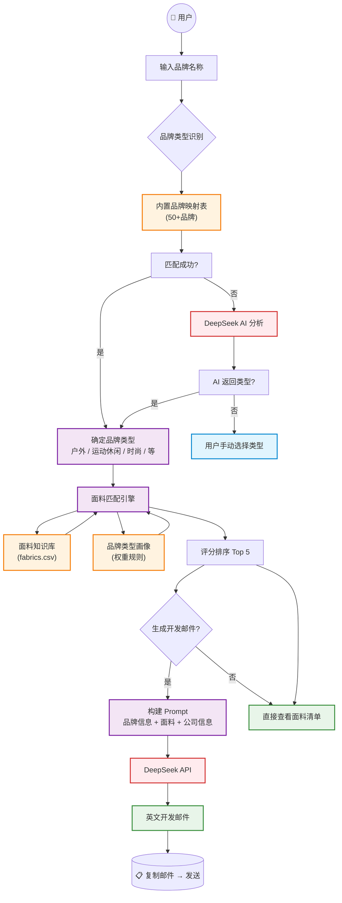

# 🧵 面料外贸客户开发 Agent

一款帮助外贸业务员快速匹配面料并生成英文开发邮件的小工具。

---

## 快速访问

> **在线使用**：[https://9vhlcfhbznnwbbprzq4zss.streamlit.app/](https://9vhlcfhbznnwbbprzq4zss.streamlit.app/) — 打开即用，无需登录、无需安装。

## 功能概览

- **品牌—面料智能匹配**：输入品牌名（如 Patagonia、Nike、Zara），自动识别品牌类型，从面料库中推荐最合适的面料
- **英文开发邮件自动生成**：基于匹配结果，调用 AI 撰写个性化 B2B 英文邮件，纯文本输出，复制即用
- **公司信息配置**：可在左侧栏填写公司名称、工厂优势、认证信息，自动嵌入邮件

---

## 使用说明

### 首次使用

```
① 打开链接进入页面
② 左侧侧边栏 → 填入 DeepSeek API Key（如已配置可跳过）
③ （可选）填写公司信息 → 点击保存
④ 开始使用
```

### 日常使用

```
① 输入目标品牌名称（英文）
   示例：Patagonia、Lululemon、Nike、Zara、The North Face
② 品牌类型选择
   - 「自动识别」：系统先查内置品牌表，未命中则用 AI 分析
   - 手动选择：可直接指定品牌类型
③ 点击「🔍 开始匹配」
④ 查看推荐面料（匹配度 + 推荐理由）
⑤ 点击「✍️ 生成开发邮件」
⑥ 点击「📋 复制邮件」→ 粘贴到邮箱发送
```

### 公司信息配置（可选）

在左侧侧边栏填写，信息会自动嵌入生成的邮件中：

| 字段 | 说明 | 示例 |
|------|------|------|
| 公司名称 | 你的公司名 | XXX Textile Co., Ltd. |
| 工厂优势 | 核心优势 | 15 年生产经验，月产能 50 万米 |
| 认证信息 | 资质认证 | OEKO-TEX, GRS, ISO 9001 |
| 联系方式 | 邮箱/电话 | info@company.com / +86- |

---

## 系统架构



---

## 注意事项

### 🔑 API Key
- API Key 在部署时已配置，一般无需手动填写
- 如需自行配置，在侧边栏填入 DeepSeek API Key 即可

### 🧪 品牌识别
- 内置 50+ 常见品牌（Patagonia、Nike、Adidas、Lululemon、Zara 等），直接命中
- 未知品牌会自动调用 AI 分析
- 也可手动选择品牌类型

### 📋 邮件使用
- 生成的邮件为纯文本格式，无多余符号，复制即用
- 邮件中的 `[Your Name]`、`[Your Company]` 等需要手动替换
- 「重新生成」按钮可重新生成
- 「修改邮件内容」可输入修改意见（如"语气更正式"），AI 会根据反馈重写

### 📊 匹配逻辑
- 匹配结果是规则评分，非 AI 判断
- 评分依据：面料类别权重 + 品牌适配度 + 功能关键词
- 如果推荐结果不符合预期，可尝试手动选择其他品牌类型

---

## 项目结构（开发参考）

```
fabric-agent/
├── app.py                          # 主程序
├── requirements.txt                # 依赖清单
├── knowledge_base/                 # 面料知识库
│   ├── fabrics.csv                 # 面料数据（29款功能性面料）
│   ├── brand_profiles.py           # 品牌类型画像 & 匹配规则
│   └── fabric_loader.py            # 数据加载
├── matching_engine/                # 匹配引擎
│   ├── matcher.py                  # 评分排序算法
│   └── brand_analyzer.py           # 品牌类型识别
└── email_generator/                # 邮件生成
    ├── prompt_templates.py         # Prompt 模板
    └── generator.py                # AI 调用逻辑
```

## 自定义扩展

### 新增面料

编辑 `knowledge_base/fabrics.csv`，按格式添加新行：

```csv
fabric_id,name,features,applications,selling_points,category,suitable_brand_types,weight,composition
F-011,新面料名称,功能1、功能2,适用产品1、适用产品2,核心卖点,面料类别,"户外,运动休闲",150g/m²,100%涤纶
```

### 新增品牌映射

编辑 `knowledge_base/brand_profiles.py`，在 `BRAND_TYPE_MAP` 中添加：

```python
"new_balance": "运动休闲 (Athleisure)",
```

---

## 常见问题

**Q: 生成的邮件内容不够自然？**
A: 可在「修改邮件内容」中输入具体反馈重新生成。

**Q: 如何切换暗黑模式？**
A: 点击右上角菜单 → Settings → Theme → 选择 Dark。

---

## 版本信息

| 版本 | 日期 | 说明 |
|------|------|------|
| v1.0 | 2026-06 | 初始版本 |
